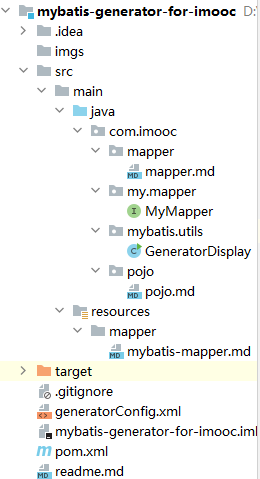

# Mybatis 数据库逆向生成工具模板

### 项目目录结构：



#### 1.使用时要创建com.imooc.mapper文件夹和com.imooc.pojo文件夹，并创建resources资源目录

#### 2.使用时需要配置generatorConfig.xml配置文件对应的包路径，数据库信息，以及数据库表

#### 3.运行com/imooc/mybatis/utils/GeneratorDisplay.java文件，生成对应的pojo类，mapper类，以及与mapper类对应的mybatis配置脚本

#### 4.接下来就将 生成的pojo类，mapper类，MyMapper，以及生成的mybatis mapper配置文件拷贝到实际项目中

#### 5.在实际项目中application.yml中配置

```yml
############################################################
#
# mybatis mapper 配置
#
############################################################
# 通用 Mapper 配置
mapper:
  mappers: com.imooc.my.mapper.MyMapper
  not-empty: false  # 在进行数据库操作的时候，判断表达式 username != null, 是否追加 username != ''
  identity: MYSQL  # 数据库方言
```

#### 6.在实际项目中添加依赖

```xml
        <!--
        mybatis 逆向生成工具
        -->
        <dependency>
            <groupId>tk.mybatis</groupId>
            <artifactId>mapper-spring-boot-starter</artifactId>
            <version>2.1.5</version>
        </dependency>
```


- 注：逆向生成工具对mapper/*.xml的生成是增量式的，如果多次运行会重复生成，使用时需要注意；使用时注意generatorConfig.xml中配置的包名需要与使用项目的报名一一对应


### 通用Mapper接口所封装的常用方法

1.首先先来看一下 MyMapper 所继承的父类，如：

```java
interface MyMapper<T> extends Mapper<T>,MySqlMapper<T>
```

这里有两个父类， Mapper 与 MySqlMapper ，我们可以打开 MySqlMapper 看一下：

```java
interface MySqlMapper<T> extends InsertListMapper<T>,InsertUseGeneratedKeysMapper<T>{}
```

这里面又继承了了两个mapper，从类名上可以看得出来，是用于操作数据库的，这两个类里又分别包含了如下方法，简单归类一下：

| 方法名                         | 操作         | 备注       |
| ------------------------------ | ------------ | ---------- |
| insertList(list)               | 数据批量插入 | 主键须自增 |
| insertUseGeneratedKeys(record) | 插入表数据   | 主键须自增 |

很明显，在传统JavaWeb开发，这两个方法使用是没有问题的，但是我们的数据库表主键设计肯定是全局唯一的，所以不可能使用自增长id（如何设计全局唯一分在后续课程里有具体的讲解），所以这两个方法在我们开发过程中是不会使用的，这一点需要注意噢~！

2.随后再来看一下 Mapper 中所继承的父类，如下：

```java
interface Mapper<T> extends BaseMapper<T>,ExampleMapper<T>,RowBoundsMapper<T>
```

分别来看一下各个父类中的方法有些啥？

```
BaseMapper<T>
```

| 类               | 方法                                      | 操作                                             |
| ---------------- | ----------------------------------------- | ------------------------------------------------ |
| BaseSelectMapper | T selectOne(T record)                     | 根据实体类中的属性查询表数据，返回单个实体       |
|                  | List select(T record)                     | 根据实体类中的属性查询表数据，返回符合条件的list |
|                  | List selectAll()                          | 返回该表所有记录                                 |
|                  | int selectCount(T record)                 | 根据条件查询记录数                               |
|                  | T selectByPrimaryKey(Object key)          | 根据主键查询单挑记录                             |
|                  | boolean existsWithPrimaryKey(Object key)  | 查询主键是否存在，返回true或false                |
| BaseInsertMapper | int insert(T record)                      | 插入一条记录，属性为空也会保存                   |
|                  | int insertSelective(T record)             | 插入一条记录，属性为空不保存，会使用默认值       |
| BaseUpdateMapper | int updateByPrimaryKey(T record)          | 根据实体类更新数据库，属性有null会覆盖原记录     |
|                  | int updateByPrimaryKeySelective(T record) | 根据实体类更新数据库，属性有null改属性会忽略     |
| BaseDeleteMapper | int delete(T record)                      | 根据实体类中属性多条件删除记录                   |
|                  | int deleteByPrimaryKey(Object key)        | 根据主键删除记录                                 |

ExampleMapper ，Example类是用于提供给用户实现自定义条件的，也就是 where 条件，主要方法见如下表格：

| 类                             | 方法                                                         | 操作                         |
| ------------------------------ | ------------------------------------------------------------ | ---------------------------- |
| SelectByExampleMapper          | List selectByExample(Object example)                         | 根据条件查询记录list         |
| SelectOneByExampleMapper       | T selectOneByExample(Object example)                         | 根据条件查询单条记录         |
| SelectCountByExampleMapper     | int selectCountByExample(Object example)                     | 根据条件查询记录数           |
| DeleteByExampleMapper          | int deleteByExample(Object example)                          | 根据条件删除记录             |
| UpdateByExampleMapper          | int updateByExample(T record, @Param(“example”) Object example) | 根据条件更新数据，null会覆盖 |
| UpdateByExampleSelectiveMapper | int updateByExampleSelective(T record, Object example)       | 根据条件更新数据，null会忽略 |

RowBoundsMapper 这个是用于做分页的，我们在后续阶段中会使用page-helper这个组件来替代这个分页实现

### **总结**

通用mapper所提供的CRUD方法对单表操作，大大提高开发效率，当然复杂的多表操作还是需要在mapper.xml中自己去编写sql代码实现。

本小节列举了通用mapper中常用的一些方法，在后续阶段课程里我们也都会去使用的